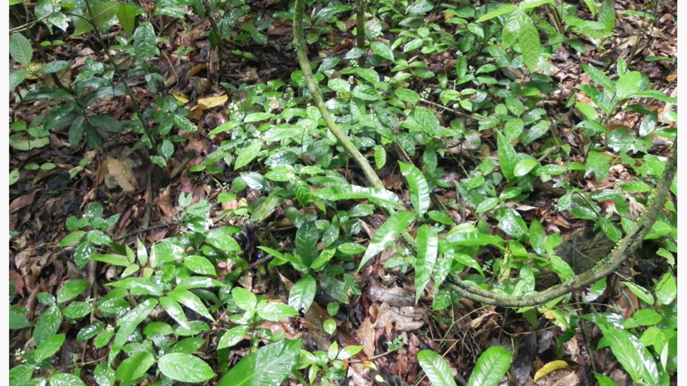
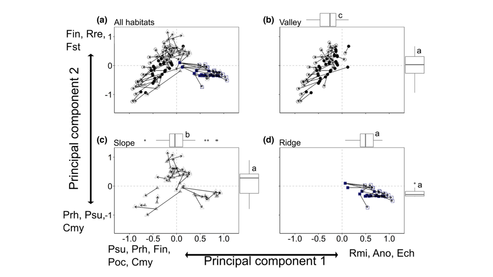
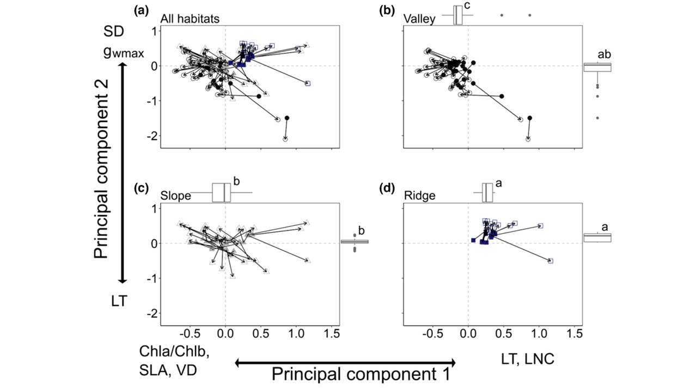
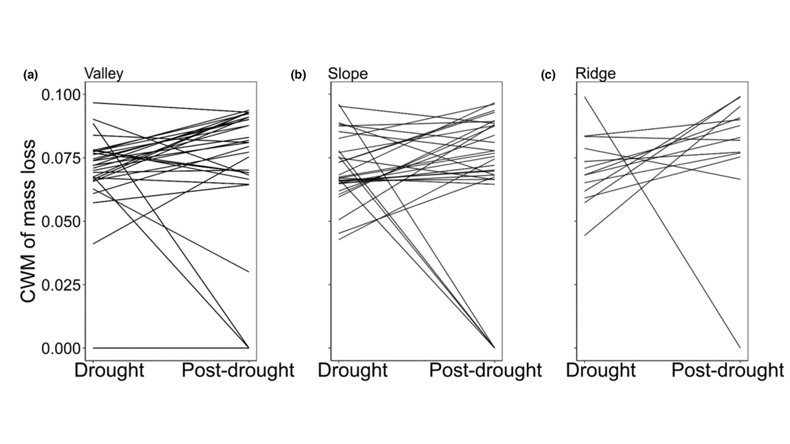

<h1 align="center">Post-drought community turnover and functional redundancy in a tropical forest understorey </h1>

 
 

*The image represents an aggregate of Rubiaceae species in the understory of a tropical forest.* 

This is an article written during my PhD in Ecology (2019-2023). The article was accepted in the Journal of Vegetation Science. [To access the paper](https://onlinelibrary.wiley.com/doi/full/10.1111/jvs.13256).

# 1. Study problem
Drought events are increasingly frequent, threatening the biodiversity of tropical forests. The understorey comprises a large fraction of the total plant species richness of these systems with the presence of highly diverse angiosperm families. Here, we quantified the effects of a drought on abundance and functional structures and on the ecosystem functioning of Rubiaceae assemblages along a topographic gradient.

# 2. Data description
Data for this study can be found on the [Zenodo platform](https://zenodo.org/records/10936188). 

# 3. Methods
Two vegetation surveys were performed: one during an El Niño-induced drought, and the other three years after this drought. Abundance and functional structures were assessed using the 16 most-abundant species of Rubiaceae, which comprised 92% of the total abundance. A litter decomposition experiment was carried out to estimate the percentage of mass loss by the Rubiaceae species. We carried out Procrustes analyses on abundance and functional structures and used Generalized Linear Mixed Models to test the effects of drought and topographic habitats on taxonomic and functional compositions, and mass loss.

# 4. Insights 
We hypothesize that, after a drought: 

### **Hypothesis 1.** Plant community abundance structure will change directionally. 

  

### **Hypothesis 2.** The functional composition will not change.

  

### **Hypothesis 3.** Thus keeping litter decomposition unchanged after the drought.

  

If these hypotheses are true, then responses to drought will differ along the topographic gradient, with functional redundancy in the Rubiaceae community leading to a stable ecosystem functioning. 

# 5. Results
We found that the functional structure and mass loss remained constant despite significant changes in the abundance 

# 6. Conclusion
The evidence points to the maintenance of ecosystem functioning through functional redundancy, because functionally similar less abundant species replaced each other after the drought. We show that swarms of species can maintain biological diversity and stability in ecosystem functioning under drought in the understorey of a tropical forest.

# 6. Next steps
Use phylogenetic composition information  can help us understand the stability of the ecosystem and, consequently, the functions it performs.

------------
# Contato
 

[e-mail](karinnasantos0@gmail.com)

[Portifólio de projetos](https://karinnasantos.github.io/project_portfolio/)

[Medium](https://medium.com/@karinnasantos0)

